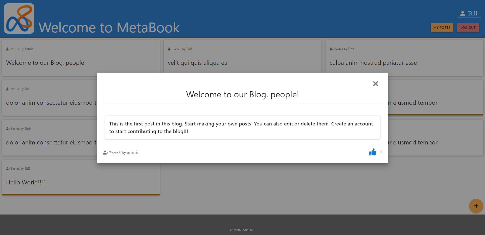
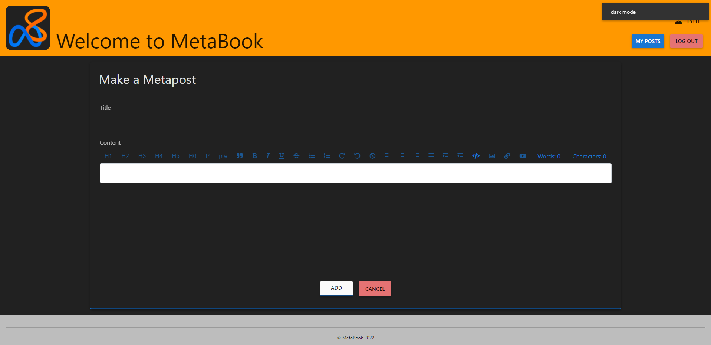

#  MetaBook 
### A Single Page Web App Blog built on AngularJS
### Other technologies: 
* Backend setup with **NodeJS** and **ExpressJS**
* Data stored in **JSON** file (pseudo-database)
* AngularJS **Material** as frontend framework
* **HTML** and **CSS** as main technologies
* Client Project Management with **NPM** and **Webpack 4**
* Server Project Management with **NPM**
* Text editor by **TextAngular**
### Features:
* Dark theme available.
* User can add, edit and delete posts after creating an account.
## Images of the App:

Main page of the app with the list of posts and a preview of an open post.
 
 

Add post page in dark mode showing the form to add a new post with a title and a content editor.

## Configuration
### For the project to work you need to have:
* Linux Software or WSL, because Webpack 4 probably won't work for Windows (not tested on Mac).
* NodeJS LTS version installed in your pc. 
* To set up the Server-side project open the /server folder in any terminal and `npm install`
* To set up the Client-side project open the /client folder in any terminal and `npm install`

## Execution
### To run the Server-side project open the /server folder in any terminal and `npm start`
### To run the Client-side project open the /client folder in any terminal and `npm start`
